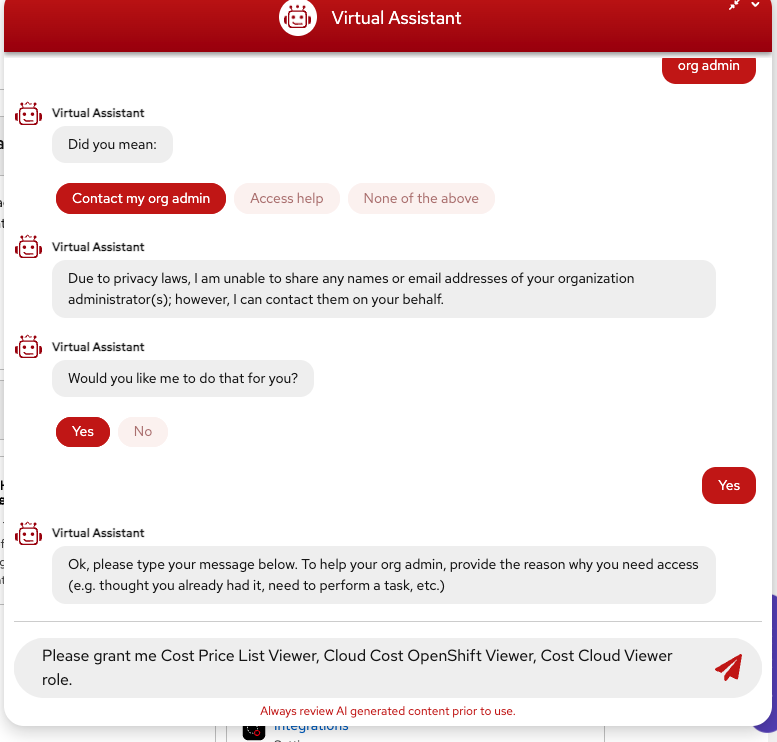
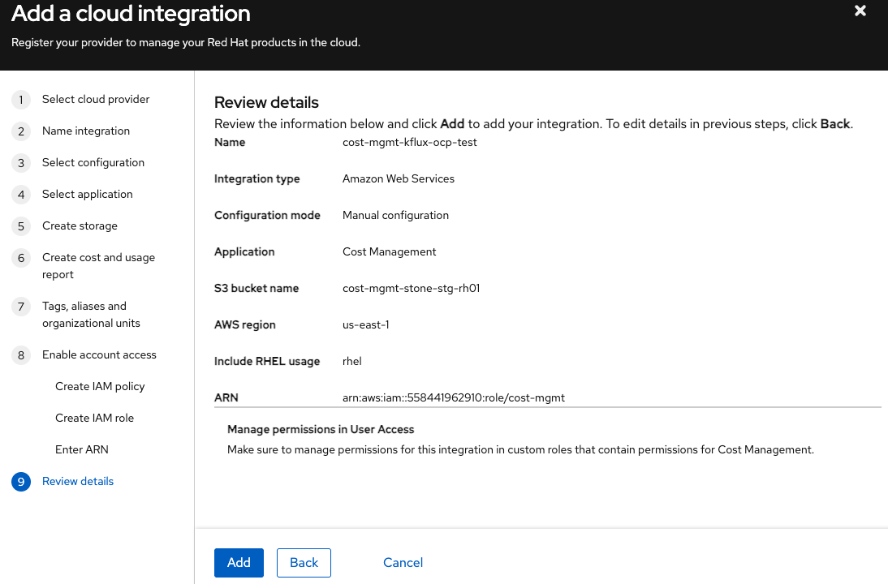

# Cost Management Operator for Konflux Clusters

## Overview

The Cost Management Operator provides cost tracking and optimization for Konflux build pipeline workloads on OpenShift. It integrates with Cost Explorer to offer detailed cost visibility and optimization recommendations.


> **Note:** This solution currently applies only to Build pipeline workflows. Release and Integration workflows are not yet supported. 

## Table of Contents

- [Quick Start](#quick-start)
- [Administrator Guide](#administrator-guide)
- [Policy Configuration](#policy-configuration)
- [References](#references)
- [Maintainers](#maintainers)
- [Demo](#demo)


---

## Quick Start

Here's how to get started with cost management:

1. **Find Your Cost Center ID**
   - Option A: Use the lookup script
        ```bash
        git clone https://gitlab.cee.redhat.com/rrajashe/konflux-release-data.git
        cd konflux-release-data/tenants-config
        ./ldapsearch.sh resolve YOUR_USERNAME 

        # Example output:
        ./ldapsearch.sh resolve rrajashe
        678
        ```

    - Option B: Contact your manager to know your cost-center.

2. **Label Your Namespace**
   - Add the required cost management labels to your tenant namespace:
     ```yaml
     cost-center: "<value>"
     insights_cost_management_optimizations: "true"
     ```
     If you are not sure of your cost-center value, just run the [ldapsearch.sh](https://gitlab.cee.redhat.com/rrajashe/konflux-release-data/-/blob/main/tenants-config/ldapsearch.sh?ref_type=heads)
     ```
     ./ldapsearch.sh resolve rrajashe
     678
     ```

3. **Verify your namespace labelling**
    - Check that your labels were applied correctly:
        ```bash
        oc get namespace my-team-tenant --show-labels
        ```
        You should see both cost-center and insights_cost_management_optimizations labels in the output.

4. **Confirm Access**
    To contact your organization admin for Cost Management UI access:
    1.  Go to [console.redhat.com](https://console.redhat.com/).
    2.  Click the **Virtual Assistant chat box** in the **bottom-right corner**.
    3.  In the chat, type **"Org admin"** and press Enter.
    4.  When prompted by the virtual assistant, select the option to **"Contact my org admin"**.
    5.  When asked if you'd like the virtual assistant to contact them for you, type **"Yes"** and press Enter.
    6.  Finally, in the chat message to your organization admin, type the following:
        **"Please grant me Cost Price List Viewer, Cloud Cost OpenShift Viewer, Cost Cloud Viewer role."**
    

5.  **Use Cost Explorer**

    On the Cost Explorer page:
    * Select **Perspective -> "OpenShift"**.
    * Filter by **project** and **cost-center label**.
    * Apply Filters:
        * Account -> `stonesoup-stage`
        * Project -> `-tenant`
    * Choose **Show cost as Amortized** (for Show-Back Reporting).
    * Use the **Optimizations** tab for efficiency recommendations.
    * Export reports (CSV, PDF, etc.) as needed.

    The "Optimizations" tab offers:
    * **Right-sizing suggestions**: Reduce over-provisioned resources.
    * **Idle resource identification**: Find unused or underutilized resources.
    * **Cost-saving opportunities**: Specific recommendations with estimated savings.

6.  **Get Help**

    Contact the **PV Observability team** or ping us in Slack.

---
## Administrator Guide

### Infrastructure Setup

#### Prerequisites for Administrators
* AWS account with administrative privileges
* Konflux cluster administrative access
* Understanding of Kyverno policies and ArgoCD
* Access to Red Hat Hybrid Cloud Console

#### Deploying to New Clusters

1. **Configure ArgoCD Applications**

   Modify `argo-cd-apps/base/all-clusters/infra-deployments/cost-management/costmanagement-metrics-operator.yaml` to include your new cluster.

2. **Create Cluster-Specific Configuration**

   Create the following files for your new cluster:
   ```
   components/cost-management/<environment>/<new-cluster>/cost-management-config-source-patch.yaml
   components/cost-management/<environment>/<new-cluster>/kustomization.yaml
   ```

3. **Set Up Cloud Integration**

   Follow the [unfiltered AWS cloud integration guide](https://docs.redhat.com/en/documentation/cost_management_service/1-latest/html-single/integrating_amazon_web_services_aws_data_into_cost_management/index#assembly-adding-aws-int):

   - Use **Manual configuration** (not recommended configuration mode)
   - Ensure cloud integration name matches your S3 bucket name
   - Use default data set for cost and usage reports
   - Copy External ID and Role ARN accurately
   - Complete IAM setup for cost data access
    

---

## Policy Configuration

**validate-cost-management-label**
- Prevents tenant namespace creation without proper cost management labels
- Ensures cost-center label exists and contains only numeric values
- Blocks namespace creation if validation fails

**propagate-cost-management-labels**
- Propagates the `cost-center` label from non-managed tenant namespaces to pods and sets the `insights_cost_management_optimizations` label to `true` on those pods.
- Skips managed tenant namespaces (different use case)
- Applied during pod creation

---

## References

- [Red Hat Cost Management Docs](https://access.redhat.com/documentation/en-us/cost_management_service/)
- [Namespace Label SOP](https://konflux.pages.redhat.com/docs/users/getting-started/create-tenant-namespace.html#manually-adding-a-namespace)
- [Namespace Creation Script](https://gitlab.cee.redhat.com/releng/konflux-release-data/-/blob/main/tenants-config/add-namespace.sh?ref_type=heads)

---

## Maintainers

- PV Observability & Monitoring Team
- FinOps & Infra Stakeholders

For questions or updates, raise an issue or ping the team in Slack.

---

## Demos

For more details, you can view the demos:

[Implementation Demo](https://drive.google.com/file/d/1F4SZUlMdDkc0O1zvsT5CbxhYi6jzE_ab/view?usp=drive_link)

[Cost Management UI Demo](https://drive.google.com/file/d/1-3YZtWy-ge9q2SxZMVGxCcs4YnD_3_1Y/view?usp=drive_link)

🎯 **Let’s make every core count!**