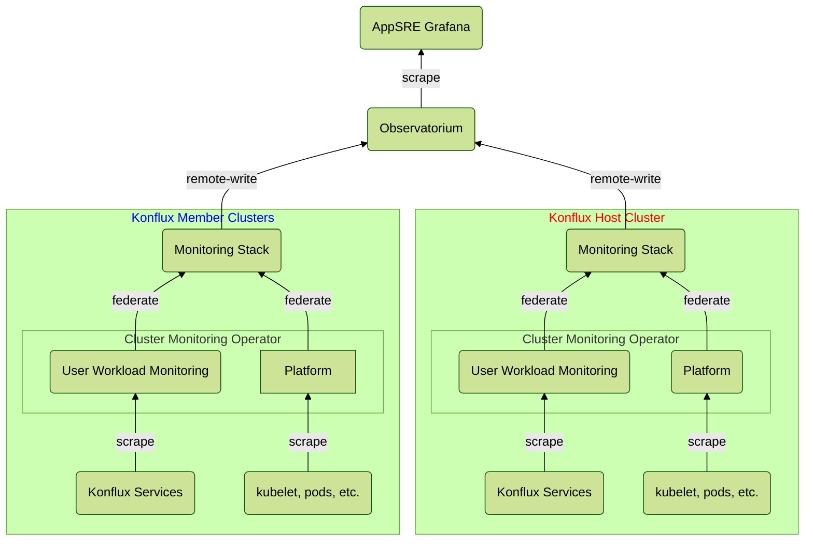

# Konflux Central Monitoring
The Konflux monitoring solution is based on three Prometheus instances deployed to each
Production and Staging host and member cluster. Each cluster writes a subset of the
metrics it generates into Observatorium (RHOBS), marking each metric with a label
indicating its cluster of origin.

Observatorium holds metrics for Konflux's tenant in two RHOBS environments – Production
and Staging. The metrics collected for each of those environments are available for
presentation via the AppSRE Grafana instance.


## Data Plane Clusters Prometheus Instances
We use the
[Openshift-provided](https://docs.openshift.com/container-platform/4.12/monitoring/monitoring-overview.html)
Prometheus deployments, Platform and user-workload-monitoring (UWM), alongside a
Prometheus instance deployed by the
[Cluster Observability Operator](https://docs.openshift.com/container-platform/4.15/observability/cluster_observability_operator/cluster-observability-operator-overview.html).

### Platform Prometheus
Mainly scrapes generic metrics produced by built-in exporters such as cAdvisor and
kube-state-metrics.

Retention for platform metrics gathered by this Prometheus instance cannot be changed, as they are managed by the ROSA. [See this KB article](https://access.redhat.com/solutions/4280821) for details about default retention settings of ROSA clusters. Any metrics not pushed to RHOBS will be lost when retention time or storage runs out. Any data gathering necessary for RCA must be done within the retention period, before it is erased.

### User Workload Monitoring (UWM) Prometheus
Scrapes custom metrics provided by services deployed by the different Konflux teams, and
collected by Service Monitors, also provided by the teams.

In Production and Staging, UWM Prometheus is enabled using OCM (since it maintains the
Prometheus configurations).
The retention period and size is maintained using an ArgoCD-controlled
[ConfigMap](./base/uwm-config/uwm-config.yaml).

In Development this ConfigMap is created implicitly when UWM is enabled. Consequently,
the retention period and size assume their default values. To configure those for a development environment, edit the  `user-workload-monitoring-config` ConfigMap in
`openshift-user-workload-monitoring` namespace.

For example:
```yaml
apiVersion: v1
kind: ConfigMap
metadata:
  name: user-workload-monitoring-config
  namespace: openshift-user-workload-monitoring
data: 
  config.yaml: | 
    prometheus: 
      retention: 2d 
      retentionSize: 1GiB
```

### Observability Operator (OBO) Prometheus
This instance federates the Platform and UWM Prometheus instances.

There are limitations for both built-in Prometheus instances that do not allow us to
use them directly to write metrics to RHOBS:

- The configurations of the Platform Prometheus instance are owned by SRE Platform, thus
we cannot configure this instance to remote-write.
- Service Monitors for The UWM Prometheus instance are limited for scraping metrics
from the same namespace in which the Service Monitor is defined. It means that this
instance cannot federate the Platform Prometheus instance, thus cannot hold all data
needed to be exported (it also cannot remote-write metrics coming from different
namespaces).

For those reasons, another instance is needed to federate the other instances, and
write metrics to RHOBS.

This instance collects selected metrics from Platform Prometheus and UWM Prometheus, and
remote-writes selected labels for those metrics to RHOBS, which in turn, makes the
metrics accessible to AppSRE Grafana.

This Prometheus instance is deployed using a MonitoringStack custom resource provided
by the Cluster Observability Operator. This operator is installed by default in Production and Staging clusters via a [Subscription](base/observability-operator/observability-operator.yaml).
In Development clusters, it's not installed by default to prevent conflicts with other deployments. 
It can be installed and configured in development by using the `--obo/-o` flags.
For example:

`./hack/bootstrap-cluster.sh preview --obo`  
`./hack/bootstrap-cluster.sh preview -o`

### Federation and Remote-write

Through Federation and remote-write configurations, only a subset of the metrics and
the labels collected within the data plane clusters reach RHOBS. For that reason, it
might be that metrics that are visible via the OCP web console (under Observe -->
Metrics) do not reach RHOBS and are not visible in AppSRE Grafana.

The Platform Prometheus instance monitors a wide variety of resources which are, in
nature, of an unbound cardinality (e.g. containers, pods, jobs, pipelineruns, taskruns).
Consequently, it generates a substantial amount of metrics time series that cannot all
be forwarded to RHOBS. For that reason, we only allow a very small subset of the metrics
it scrapes to be federated by the OBO Prometheus instance (and later remote-written to RHOBS).

The UWM Prometheus instance, on the other hand, generates a very few time series by
default, and the metrics it is configured to scrape for services are generally of
constant cardinality. I.e. the number of time series stored for a given service does
not grow based on the service load. For this reason, we allow all metrics it scrapes
to be federated by the OBO Prometheus instance (and reach RHOBS).

All **metrics** reaching the OBO instance are remote-written to RHOBS, but not all
**labels** are. This means that it might be that time series visible in AppSRE Grafana
will not include some of the labels the same time series have on the data plane
clusters. The OBO instance is configured to remote-write only specific labels, and if
the presence of a new label is required in alerting rules or AppSRE Grafana dashboards,
then this label should be added to the configurations.
