# Kargo-Based Ring Deployments for Konflux

> **Warning**
> Ring deployments are still under active development. This documentation may change as the implementation evolves.

Ring-based promotion pipeline for [infra-deployments](https://github.com/redhat-appstudio/infra-deployments) and [infra-common-deployments](https://github.com/redhat-appstudio/infra-common-deployments) using [Kargo](https://kargo.io).

## Table of Contents

1. [Objective](#1-objective)
2. [Motivation](#2-motivation)
3. [Proposed Architecture](#3-proposed-architecture)
   - 3.1 [Kargo Project and Pipeline Structure](#31-kargo-project-and-pipeline-structure)
   - 3.2 [Cluster Segmentation Strategy](#32-cluster-segmentation-strategy)
   - 3.3 [CI and Artifact Ingestion](#33-ci-and-artifact-ingestion)
   - 3.4 [Ring 0 — Development](#34-ring-0--development-automated-inner-loop)
   - 3.5 [Ring 1 — Staging](#35-ring-1--staging-convergence-and-extended-verification)
   - 3.6 [Ring N to N+1 — Gated Production](#36-ring-n-to-n1--gated-production-promotion)
   - 3.7 [Verification Strategy](#37-verification-strategy)
   - 3.8 [Rollback and Reliability](#38-rollback-and-reliability)
   - 3.9 [Observability and Auditability](#39-observability-and-auditability)
4. [Component Interaction Model](#4-component-interaction-model)
5. [Freight Lifecycle](#5-freight-lifecycle)
6. [Kargo Resource Examples](#6-kargo-resource-examples)
7. [Failure Mode Analysis](#7-failure-mode-analysis)
8. [Definitions](#8-definitions)

---

## 1. Objective

Implement an automated, ring-based deployment pipeline for Konflux components using [Kargo](https://kargo.io) to improve deployment safety, reduce manual effort, and ensure continuous availability. The pipeline leverages Kargo's native promotion engine—Warehouses, Freight, Stages, and Promotions—to model ring-based progressive delivery as a first-class GitOps workflow.

---

## 2. Motivation

Without ring-based delivery, changes to Konflux components would be promoted to all production clusters simultaneously after staging validation. That model is:

- **Time-consuming**: Each promotion requires human coordination across multiple clusters.
- **Error-prone**: Manual steps introduce configuration drift and inconsistency.
- **High-risk**: A broken deployment affects all clusters simultaneously. Rollback is particularly dangerous because the broken version of Konflux may be required to build and ship the fix itself—creating a circular dependency where the deployment tool is degraded by its own deployment.

### Without Rings vs. With Rings

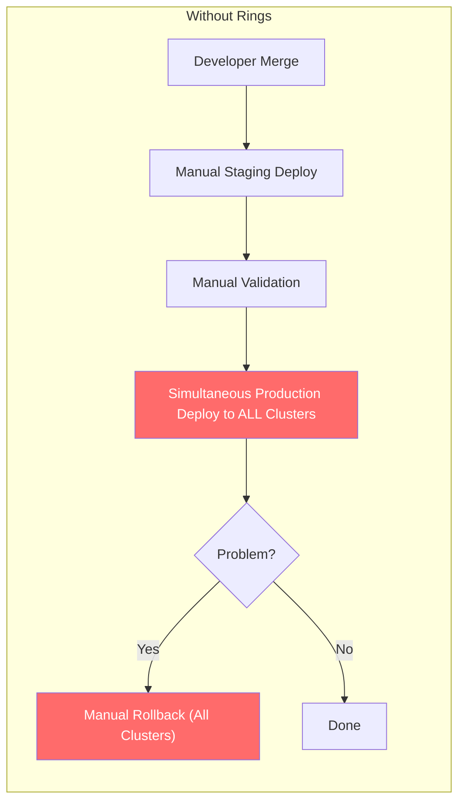

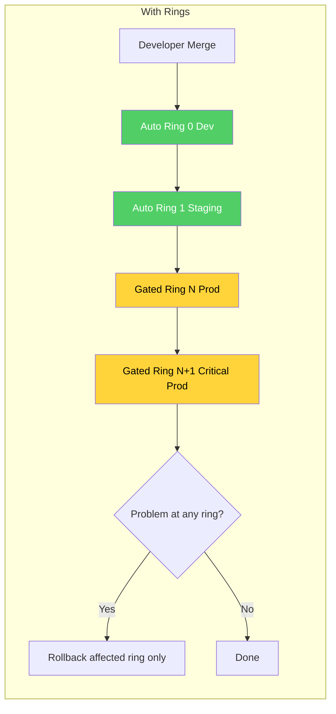

A ring-based model isolates blast radius, preserves build infrastructure availability, and automates the promotion lifecycle while retaining human oversight at critical boundaries.

---

## 3. Proposed Architecture

### 3.1 Kargo Project and Pipeline Structure

Each Konflux infrastructure repository is modeled as a **Kargo Project**—the unit of tenancy that scopes all pipeline resources (Warehouses, Stages, Promotions, Freight) to a single Kubernetes namespace. The two primary Kargo Projects map to the existing infrastructure repos:

- **[infra-deployments](https://github.com/redhat-appstudio/infra-deployments)** — Application-level component deployments (Konflux services, operators, controllers).
- **[infra-common-deployments](https://github.com/redhat-appstudio/infra-common-deployments)** — Shared infrastructure and platform-level resources (cluster config, RBAC, networking, observability).

This separation provides:

- **Isolation**: RBAC boundaries per infrastructure repository pipeline.
- **Independent Cadence**: Application components and shared infrastructure advance through rings at their own pace without blocking each other.
- **Auditability**: All promotion activity is scoped and queryable per project.

Both repositories follow a **canonical directory layout** that ensures every component is structured identically across all rings and clusters. Kargo PromotionTasks write to a single, computable path per ring — the Tier 2 ring base (`components/{component}/rings/ring-N/base/kustomization.yaml`). For the full directory standard, tier definitions, and Kustomize layering rules, see the [Canonical Directory Layout](directory-layout.md) specification.

Within each Project, the ring topology is modeled as a directed acyclic graph (DAG) of **Stages**, where each Stage represents a ring (or a subset of clusters within a ring). Freight flows from inner rings to outer rings through automated or gated Promotions.

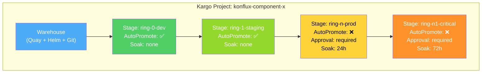

### 3.2 Cluster Segmentation Strategy

Rings are defined by a risk-based grouping strategy. Clusters are assigned to specific rings based on blast-radius potential and workload criticality:

| Ring | Scope | Criteria | Gate | Soak |
|------|-------|----------|------|------|
| **Ring 0** | Development | Low tenant impact, fast feedback loops | Fully automated | None |
| **Ring 1** | Staging | Pre-production validation, broader integration testing, Argo CD sync/health validation, production metric comparison (memory, CPU, latency baselines) | Automated with verification gates | None |
| **Ring N** | Non-critical Production | Moderate tenant count, no self-hosting dependencies | Manual approval + soak period | 24h |
| **Ring N+1** | Critical Production | High-risk tenants (e.g., RHEL), mission-critical workloads, self-hosting infrastructure | Manual approval + extended soak | 72h |

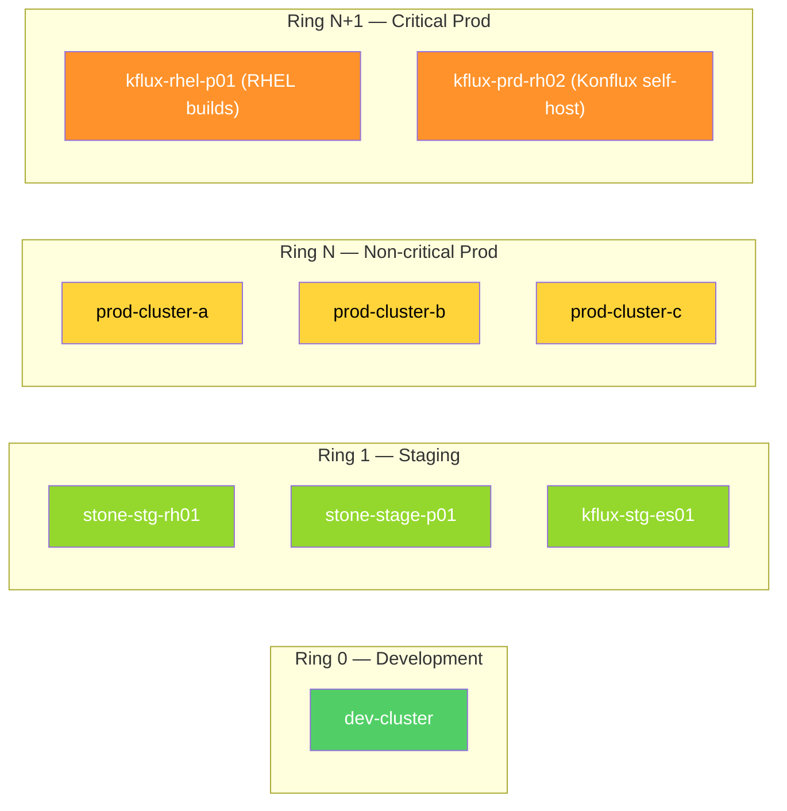

### 3.3 CI and Artifact Ingestion

The pipeline begins with artifact creation and discovery:

**Code Merge & Build**: Merging a component change triggers a Konflux build pipeline, producing versioned container images, Helm charts, and/or Git manifest commits.

**Kargo Warehouse**: A Warehouse is configured per artifact source (OCI registry, Helm repository, or Git repository). Each Warehouse defines **subscriptions** that specify:

- The artifact source URL (e.g., Quay registry, Helm repo, Git repo)
- The discovery strategy: **SemVer** (semantic version ordering), **Lexical** (string-based), **Digest** (content-addressable), or **NewestBuild** (timestamp-based)
- Optional filtering (e.g., SemVer constraints, path filters, allow/ignore lists)
- The polling interval (default: 5 minutes)

**Freight Creation**: When a Warehouse detects new artifact versions matching its subscriptions, it generates a new **Freight**—an immutable, content-addressed bundle that captures the exact combination of:

- Container image references (registry + tag + digest)
- Helm chart references (repository + name + version)
- Git commit references (repository URL + branch + commit SHA)

Freight is identified by a SHA-1 hash of its origin Warehouse and artifact versions, ensuring that identical inputs always produce the same Freight ID. This guarantees reproducibility and makes promotion decisions deterministic.

The Warehouse's `FreightCreationPolicy` controls whether Freight is created automatically upon discovery or requires an explicit manual trigger.

A Git-subscription Warehouse can also detect changes in the `new-base/` directory — a ring-safe mechanism for promoting Tier 1 (`base/`) changes. Kargo copies `new-base/` ring-by-ring and renames it to `base/` at the destination, avoiding the all-rings-at-once merge path. See [Canonical Directory Layout — Tier 1](directory-layout.md#41-tier-1--component-base) for details.

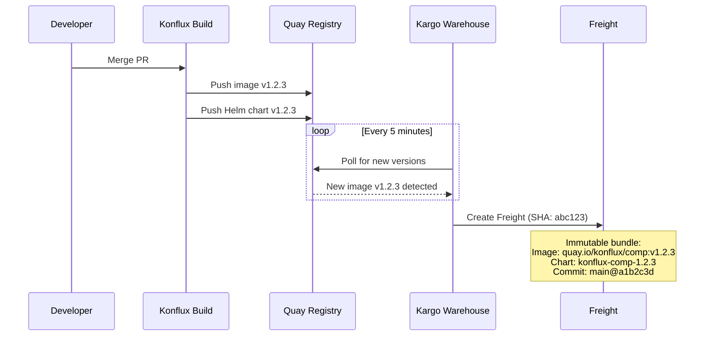

### 3.4 Ring 0 — Development (Automated Inner Loop)

Ring 0 targets development clusters with **auto-promotion enabled**. When new Freight appears from the Warehouse, the pipeline proceeds automatically:

1. **Auto-Promotion**: The Stage's promotion policy (`autoPromotionEnabled: true`) triggers a Promotion immediately when new Freight is available. The selection strategy (`NewestFreight`) ensures the latest verified Freight is promoted.

2. **Promotion Execution**: Kargo creates a **Promotion** resource and executes its ordered **promotion steps**. For GitOps-based deployments, a typical step sequence is:
   - `git-clone` — Clone the environment's configuration repository
   - `yaml-update` / `kustomize-set-image` / `helm-template` — Update manifests to reference the new Freight's artifact versions
   - `git-commit` + `git-push` — Commit and push the changes
   - `git-open-pr` — Open a Pull Request against the target branch
   - `git-merge-pr` — Merge the PR

3. **Verification**: After the Promotion succeeds, the Stage runs **Verification** using Argo Rollouts AnalysisRuns. These can execute:
   - Smoke tests and integration tests
   - Health endpoint checks
   - Custom metric queries (Prometheus, Datadog, etc.)
   - Webhook-based external test triggers

4. **Freight Marked as Verified**: Upon successful verification, the Freight's status is updated to record `VerifiedIn: ring-0-dev`, making it eligible for promotion to Ring 1.

Promotions within a Stage are **serialized**—only one Promotion runs at a time per Stage, with subsequent Promotions queued by creation time. This prevents deployment collisions and ensures each release completes its full verification cycle before the next begins.

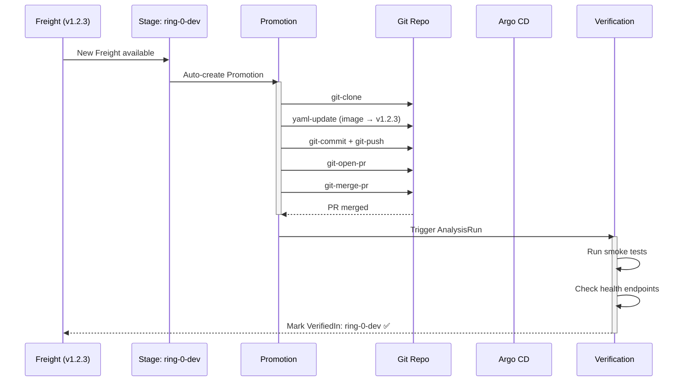

### 3.5 Ring 1 — Staging (Convergence and Extended Verification)

Ring 1 targets staging clusters and accepts Freight that has been `VerifiedIn` Ring 0. This ring validates changes under more realistic conditions before any production exposure.

When multiple upstream Stages exist (e.g., multiple Ring 0 environments), the Stage's **availability strategy** determines the gate:

- `All` — Freight must be verified in every upstream Stage before it becomes available.
- `OneOf` — Verification in any single upstream Stage is sufficient.

Promotion in Ring 1 may be auto-promoted or require manual trigger depending on the risk profile. The promotion step sequence mirrors Ring 0 but targets Ring 1's cluster configuration repositories.

After promotion, Ring 1 runs its own verification suite—typically broader integration tests that validate cross-component interactions under more realistic conditions.

### 3.6 Ring N to N+1 — Gated Production Promotion

Outer rings introduce two additional gates:

**Manual Approval**: Freight must be explicitly approved before it can be promoted to a production ring. Approval is recorded at the Freight level (`Freight.Status.ApprovedFor[stage-name]`) and can be granted by authorized users through the Kargo UI, CLI, or API. Approval can also bypass upstream verification requirements when emergency hotfixes are needed.

**Soak Period**: Each Stage can define a `RequiredSoakTime` (e.g., `24h`, `72h`). Freight must remain stable in the current ring for the specified duration before becoming eligible for the next ring. The soak timer starts when the Freight is first deployed to the Stage (`CurrentlyIn` timestamp) and is tracked continuously. This ensures:

- Long-tail issues (memory leaks, gradual degradation, intermittent failures) surface before wider rollout.
- The system observes real-world load patterns across business cycles (daily peaks, batch jobs, etc.).
- Confidence in the release increases proportionally with exposure time.

The combination of manual approval and soak periods creates a layered defense: automated systems validate functional correctness, while human judgment and time-based observation validate operational stability.

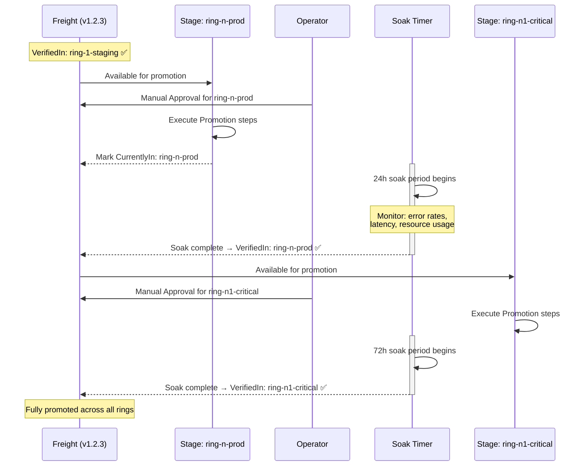

### 3.7 Verification Strategy

Verification is a first-class concept in Kargo, executed after each successful Promotion via Argo Rollouts AnalysisRuns. The verification strategy should be tiered by ring:

| Ring | Verification Scope | Examples | Duration |
|------|-------------------|----------|----------|
| Ring 0 | Functional correctness | Unit test suites, API contract tests, build pipeline smoke tests | ~10 min |
| Ring 1 | Integration stability | Cross-component integration tests, end-to-end workflow validation | ~30 min |
| Ring N | Operational readiness | Performance baselines, error rate thresholds, SLO compliance checks | 24h soak |
| Ring N+1 | Self-hosting integrity | Konflux's ability to build and promote its own components | 72h soak |

Each verification produces a pass/fail result. Failed verification prevents the Freight from being marked as `VerifiedIn` for that Stage, blocking downstream promotion automatically.

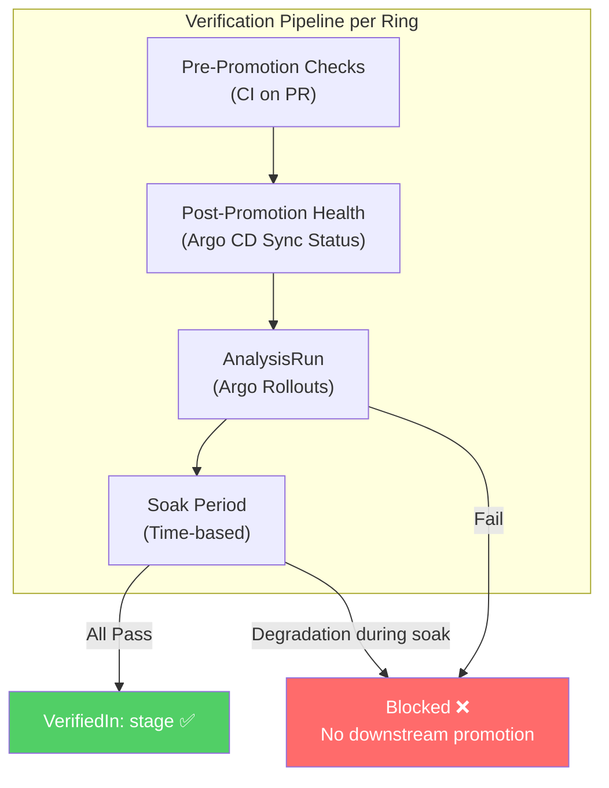

### 3.8 Rollback and Reliability

Kargo does not have a dedicated "rollback" primitive. Instead, rollback is achieved by **creating a new Promotion to a previously verified Freight**. This is architecturally consistent: every state change is a forward promotion through the same pipeline, ensuring auditability and avoiding out-of-band state mutations.

**Standard Rollback**: Identify the last known-good Freight from the Stage's Freight history (`Stage.Status.FreightHistory`). Create a new Promotion targeting that Freight. The promotion executes the same step sequence, updating manifests to reference the previous artifact versions. Only the affected ring is rolled back — downstream rings that haven't received the bad promotion are unaffected.

```bash
# Promote a specific known-good Freight to a Stage (rollback)
kargo promote --project <project> --freight <freight-id> --stage <stage>

# Or reference by alias
kargo promote --project <project> --freight-alias <alias> --stage <stage>
```

**Emergency Hotfix Path**: For critical failures where the standard pipeline is too slow or where Konflux itself is degraded:

1. Authorized operators can **manually approve** Freight for any Stage, bypassing upstream verification and soak requirements. This lets Freight skip intermediate rings entirely.
2. The hotfix Freight is promoted directly to the affected ring(s) using the same promotion steps, maintaining GitOps consistency.
3. This path is audited — manual approvals are recorded with timestamps and approver identity in the Freight status (`Freight.Status.ApprovedFor`).

```bash
# Manually approve Freight for a Stage (bypasses pipeline gates)
kargo approve --project <project> --freight <freight-id> --stage <stage>
```

**Via the Kargo UI**: click the three dots on the Freight in the timeline → "Manually Approve" → select the target Stage → "Approve". Then promote by clicking the truck icon on the Stage header → "Promote" → select the approved Freight → confirm.

Approval does not automatically create a Promotion — it only marks the Freight as eligible. A separate promotion (manual or auto) is still required.

**Reverification**: If a verification process fails or is inconclusive, it can be re-run on demand without re-promoting:

```bash
kargo verify stage <stage> --project <project>

# Abort a running verification
kargo verify stage <stage> --project <project> --abort
```

**Abort In-Flight Promotions**: Running Promotions can be aborted via the `kargo.akuity.io/abort` annotation. This immediately halts step execution, marks the Promotion as `Aborted`, and frees the Stage to accept the next queued Promotion (e.g., a rollback).

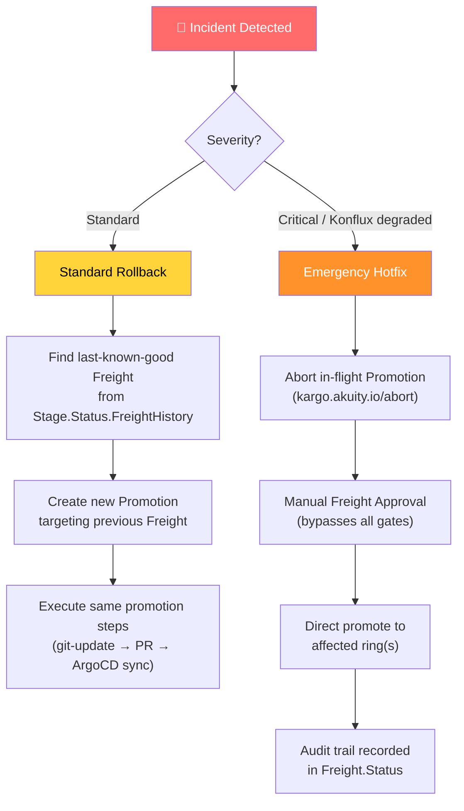

### 3.9 Observability and Auditability

Kargo provides built-in observability through its resource status model:

- **Freight Status**: Tracks which Stages a Freight is `CurrentlyIn`, `VerifiedIn`, and `ApprovedFor`—providing a real-time map of what version is deployed where and its verification state.
- **Promotion History**: Each Stage records its `CurrentPromotion` and `LastPromotion`, along with the full `FreightHistory` of recent deployments.
- **Step-level Telemetry**: Promotion status includes per-step execution metadata: start/finish times, retry counts, error messages, and state carried between reconciliation cycles.

Additional observability requirements:

- Grafana dashboards for ring transition latency, promotion success rates, and soak period compliance.
- Alerting on promotion failures, verification failures, and Freight stuck in a ring beyond expected soak windows.
- Integration with existing Konflux monitoring for correlated deployment-to-incident analysis.

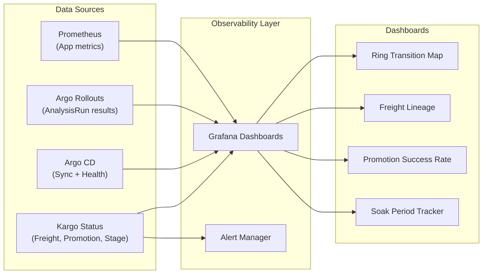

---

## 4. Component Interaction Model

This section maps how Kargo resources interact with external systems during the promotion lifecycle.

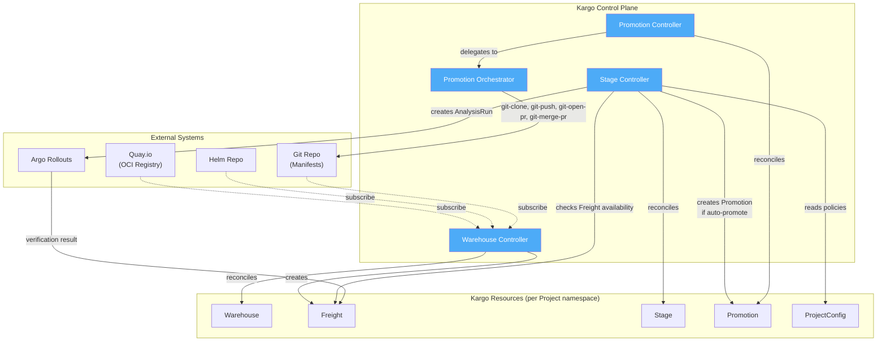

### Data Flow Summary

| Step | Source | Action | Target | Trigger |
|------|--------|--------|--------|---------|
| 1 | Quay / Helm / Git | Poll for new versions | Warehouse | Timer (5m interval) |
| 2 | Warehouse | Create immutable Freight | Freight | New artifact detected |
| 3 | Stage Controller | Check Freight availability | Freight Status | Freight creation event |
| 4 | Stage Controller | Create Promotion | Promotion | Auto-promote policy or manual |
| 5 | Promotion Controller | Execute promotion steps | Git Repo, Argo CD | Promotion created |
| 6 | Argo CD | Sync manifests to cluster | Kubernetes | Git repo updated |
| 7 | Stage Controller | Create AnalysisRun | Argo Rollouts | Promotion succeeded |
| 8 | Argo Rollouts | Report verification result | Freight Status | AnalysisRun complete |

---

## 5. Freight Lifecycle

Freight is the central artifact in the promotion pipeline. Its status transitions drive the entire ring progression.

### State Machine

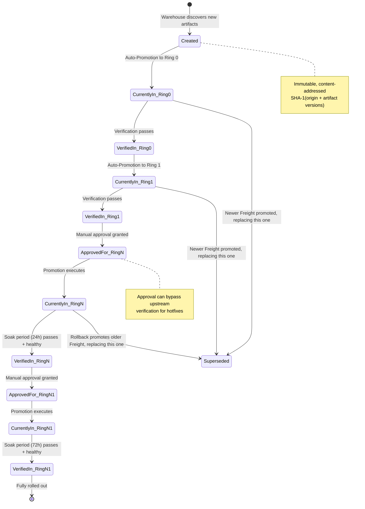

### Status Fields Reference

```
Freight.Status:
├── CurrentlyIn:           # Map of Stages where Freight is actively deployed
│   └── <stage-name>:
│       └── Since: <timestamp>     # Used for soak time calculation
│
├── VerifiedIn:            # Map of Stages where verification + soak passed
│   └── <stage-name>:
│       └── LongestCompletedSoak: <duration>
│
├── ApprovedFor:           # Map of Stages with manual approval
│   └── <stage-name>:
│       └── ApprovedAt: <timestamp>
│
└── Metadata:              # Arbitrary key-value data shared across steps/stages
```

---

## 6. Kargo Resource Examples

### 6.1 Warehouse — Image Subscription

```yaml
apiVersion: kargo.akuity.io/v1alpha1
kind: Warehouse
metadata:
  name: konflux-component-x
  namespace: konflux-component-x
spec:
  interval: 5m
  freightCreationPolicy: Automatic
  subscriptions:
    - image:
        repoURL: quay.io/konflux/component-x
        semverConstraint: ">=1.0.0"
        discoveryLimit: 5
    - chart:
        repoURL: https://charts.konflux.dev
        name: component-x
        semverConstraint: ">=1.0.0"
```

### 6.2 Stage — Ring 0 (Development, Auto-Promote)

```yaml
apiVersion: kargo.akuity.io/v1alpha1
kind: Stage
metadata:
  name: ring-0-dev
  namespace: konflux-component-x
spec:
  requestedFreight:
    - origin:
        kind: Warehouse
        name: konflux-component-x
      sources:
        direct: true
  promotionTemplate:
    spec:
      steps:
        - uses: git-clone
          config:
            repoURL: https://github.com/redhat-appstudio/infra-deployments
            checkout:
              branch: main
            path: ./src
        - uses: kustomize-set-image
          config:
            path: ./src/components/component-x/rings/ring-0/base
            images:
              - image: quay.io/konflux/component-x
        - uses: git-commit
          config:
            path: ./src
            message: "chore: promote component-x to dev"
        - uses: git-push
          config:
            path: ./src
        - uses: git-open-pr
          config:
            repoURL: https://github.com/redhat-appstudio/infra-deployments
            sourceBranch: kargo/ring-0-dev/promotion
            targetBranch: main
            createTargetBranch: false
        - uses: git-merge-pr
          config:
            repoURL: https://github.com/redhat-appstudio/infra-deployments
            provider: github
  verification:
    analysisTemplates:
      - name: smoke-tests
    analysisRunMetadata:
      labels:
        ring: "0"
        env: development
---
apiVersion: kargo.akuity.io/v1alpha1
kind: ProjectConfig
metadata:
  name: konflux-component-x
  namespace: konflux-component-x
spec:
  promotionPolicies:
    - stage: ring-0-dev
      autoPromotionEnabled: true
```

### 6.3 Stage — Ring N (Production, Gated)

```yaml
apiVersion: kargo.akuity.io/v1alpha1
kind: Stage
metadata:
  name: ring-n-prod
  namespace: konflux-component-x
spec:
  requestedFreight:
    - origin:
        kind: Warehouse
        name: konflux-component-x
      sources:
        stages:
          - ring-1-staging
      requiredSoakTime: 24h
  promotionTemplate:
    spec:
      steps:
        - uses: git-clone
          config:
            repoURL: https://github.com/redhat-appstudio/infra-deployments
            checkout:
              branch: main
            path: ./src
        - uses: kustomize-set-image
          config:
            path: ./src/components/component-x/rings/ring-n/base
            images:
              - image: quay.io/konflux/component-x
        - uses: git-commit
          config:
            path: ./src
            message: "chore: promote component-x to prod ring-n"
        - uses: git-push
          config:
            path: ./src
        - uses: git-open-pr
          config:
            repoURL: https://github.com/redhat-appstudio/infra-deployments
            sourceBranch: kargo/ring-n-prod/promotion
            targetBranch: main
        - uses: git-merge-pr
          config:
            repoURL: https://github.com/redhat-appstudio/infra-deployments
            provider: github
  verification:
    analysisTemplates:
      - name: slo-compliance-check
      - name: error-rate-threshold
---
apiVersion: kargo.akuity.io/v1alpha1
kind: ProjectConfig
metadata:
  name: konflux-component-x
  namespace: konflux-component-x
spec:
  promotionPolicies:
    - stage: ring-n-prod
      autoPromotionEnabled: false   # Requires manual approval
```

### 6.4 AnalysisTemplate — Smoke Tests

```yaml
apiVersion: argoproj.io/v1alpha1
kind: AnalysisTemplate
metadata:
  name: smoke-tests
  namespace: konflux-component-x
spec:
  metrics:
    - name: smoke-test-suite
      provider:
        job:
          spec:
            backoffLimit: 0
            template:
              spec:
                containers:
                  - name: tests
                    image: quay.io/konflux/test-runner:latest
                    command: ["/bin/sh", "-c"]
                    args:
                      - |
                        run-smoke-tests --target=$STAGE_URL
                restartPolicy: Never
      count: 1
      successCondition: result.exitCode == 0
      failureLimit: 0
```

---

## 7. Failure Mode Analysis

This section catalogs expected failure scenarios and the system's behavior in each case.

| Failure Mode | Impact | Detection | Automated Response | Human Action Required |
|-------------|--------|-----------|-------------------|----------------------|
| **Promotion step fails** (e.g., PR conflict) | Blocked promotion in one ring | Promotion phase → `Failed` | Retry on next reconciliation. Queue preserves ordering. | Investigate and resolve conflict; re-trigger Promotion |
| **Verification fails** (AnalysisRun) | Freight not marked `VerifiedIn`; downstream rings blocked | AnalysisRun phase → `Failed` | No downstream promotion occurs automatically | Review test results; fix component or adjust test thresholds |
| **Soak period degradation** | Freight fails stability check during soak | Metric thresholds breached | Freight remains `CurrentlyIn` but never reaches `VerifiedIn` | Initiate rollback via new Promotion to previous Freight |
| **Argo CD sync failure** | Cluster out of desired state | ArgoCD Application reports `OutOfSync` or `Degraded` | ArgoCD retries sync automatically | Check Argo CD Application health; resolve sync errors |
| **Warehouse polling failure** | New artifacts not discovered | Warehouse status shows error | Retries on next interval | Check registry credentials and connectivity |
| **Concurrent Freight arrival** | Multiple Freight compete for same Stage | Normal operation — queue serializes | Only one Promotion runs; next waits | None — by design |
| **Self-hosting ring failure** | Konflux cannot build fixes | Ring N+1 health checks fail | Inner rings unaffected (still on previous version) | Use emergency hotfix path: manual approval + direct promote |
| **Controller crash / restart** | Temporary reconciliation pause | Kubernetes pod restart | Controller resumes from persisted state (Promotion.Status.State) | Monitor controller pod health |

### Self-Hosting Circular Dependency — Mitigation

The most critical failure mode is when a bad release reaches the self-hosting ring (Ring N+1), degrading Konflux's ability to build the fix:

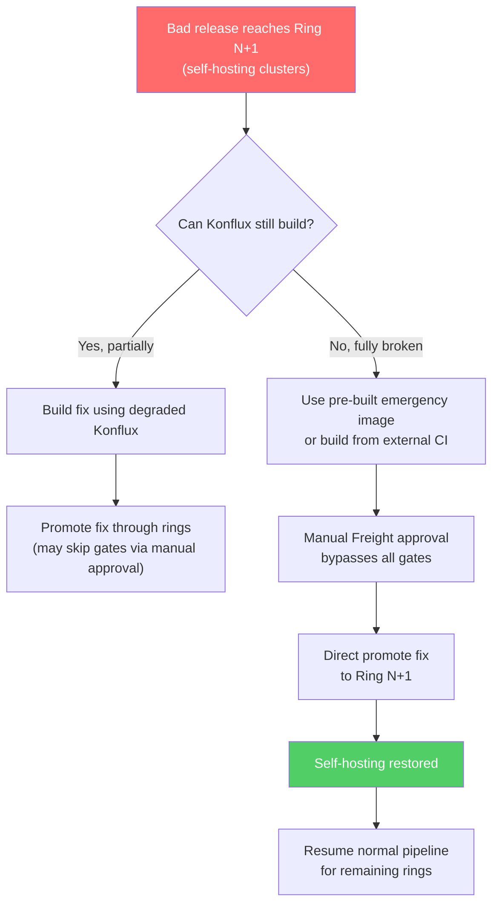

**Key design constraint**: Ring N+1 (self-hosting) always receives releases last. Even if every other ring is updated, the build infrastructure stays on the prior known-good version until the new release has soaked for 72+ hours in production.

---

## 8. Definitions

| Term | Definition |
|------|-----------|
| **Project** | The unit of tenancy in Kargo. A cluster-scoped resource associated with a Kubernetes namespace that contains all pipeline resources (Warehouses, Stages, Promotions, Freight) for a component or group of components. |
| **Warehouse** | A Kargo resource that monitors external artifact sources—OCI registries, Helm repositories, Git repositories—for new versions. Warehouses define subscriptions with discovery strategies (SemVer, Lexical, Digest) and produce Freight when new artifacts are detected. |
| **Freight** | An immutable, content-addressed "unit of release" produced by a Warehouse. Encapsulates the exact versions of container images, Helm charts, and Git commits that constitute a deployable change. Freight carries provenance metadata and tracks its verification and approval status across all Stages. |
| **Stage** | A promotion target representing a logical deployment environment or ring. Stages define what Freight they accept (from which Warehouses or upstream Stages), how to promote it (promotion step templates), and how to verify it (AnalysisRun templates). Stages form a DAG that models the ring topology. |
| **Promotion** | A request to deploy a specific Freight to a specific Stage. Promotions execute an ordered sequence of steps (Git operations, Argo CD updates, Helm operations, etc.) and are serialized per Stage to prevent conflicts. |
| **PromotionTask** | A reusable, parameterized sequence of promotion steps defined as a Kargo CRD (`PromotionTask` or `ClusterPromotionTask`). Each component has its own PromotionTask per ring, defining how Kargo updates the Git repo for that component. The canonical directory layout keeps PromotionTask definitions simple — the target path is computable from `{component}` and `{ring}`. |
| **Promotion Steps** | The ordered actions executed during a Promotion: cloning repos, updating manifests, opening PRs, waiting for merges, triggering Argo CD syncs, etc. Kargo provides 30+ built-in step types covering Git, Helm, Kustomize, Argo CD, HTTP, and more. |
| **Verification** | A post-promotion validation phase using Argo Rollouts AnalysisRuns. Verification determines whether Freight is marked as `VerifiedIn` a Stage, gating promotion to downstream rings. |
| **Soak Period** | A time-based stability requirement. Freight must remain deployed and healthy in a Stage for the configured duration before becoming eligible for promotion to the next ring. |
| **Ring** | A logical deployment stage representing a blast-radius zone. Modeled as one or more Kargo Stages. Inner rings (low risk) validate changes before outer rings (high risk) receive them. |
| **Auto-Promotion** | A per-Stage policy that automatically creates Promotions when new eligible Freight becomes available, removing the need for manual promotion triggers in lower-risk rings. |
| **Progressive Delivery** | An architectural pattern characterized by the staged promotion of software changes through multiple Rings, leveraging automated health signals and mandatory soak periods to detect and isolate failures early. |
