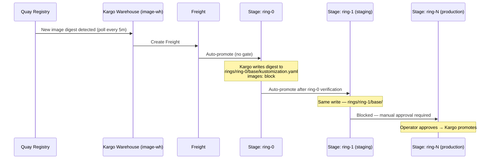
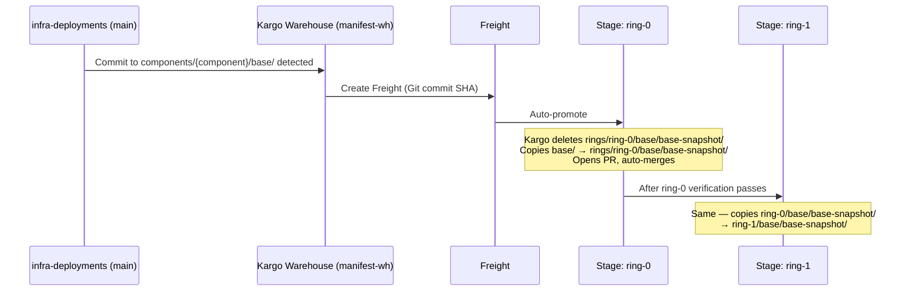
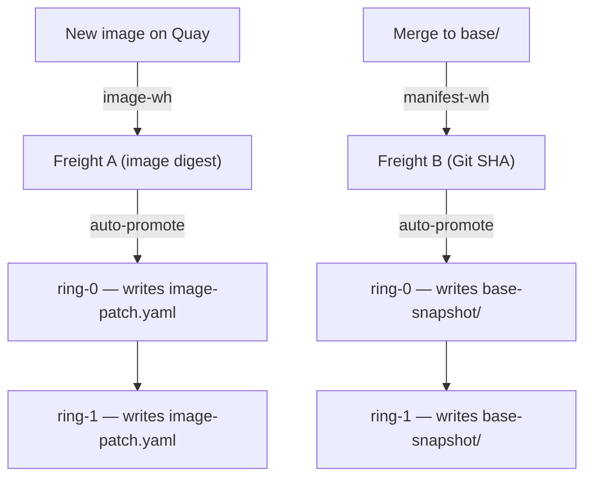
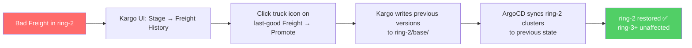
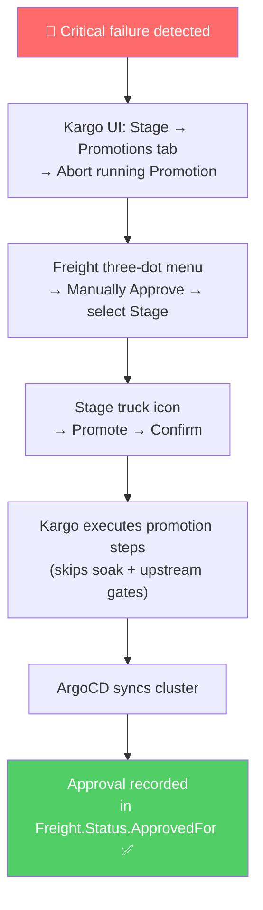
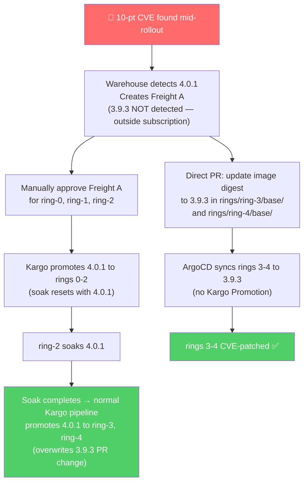

# Kargo Promotion Workflows

> **Warning**
> Ring deployments are still under active development. This documentation may change as the implementation evolves.

How-to guide for the most common Kargo promotion scenarios in infra-deployments. For background on the ring architecture and directory layout, see [architecture.md](architecture.md) and [directory-layout.md](directory-layout.md).

## Table of Contents

1. [Promoting an Image-Based Change](#1-promoting-an-image-based-change)
2. [Promoting a Cluster-Wide Resource Change](#2-promoting-a-cluster-wide-resource-change)
3. [Promoting an Image and Resource Change Together](#3-promoting-an-image-and-resource-change-together)
4. [Changing a Ring or Cluster-Specific Resource](#4-changing-a-ring-or-cluster-specific-resource)
5. [Rolling Back a Promotion](#5-rolling-back-a-promotion)
6. [Promoting a Hotfix](#6-promoting-a-hotfix)

---

## 1. Promoting an Image-Based Change

**When to use:** A new container image or Helm chart version is available (e.g. a Konflux build completed, a new chart was published). No manifest changes are involved.

**Who acts:** Nobody. Kargo handles this automatically for staging rings. Production rings require manual approval.

### What happens



### What Kargo writes

For image-based components, Kargo updates the `images:` block in `rings/ring-N/base/kustomization.yaml`:

```yaml
images:
  - name: quay.io/konflux-ci/my-component
    newName: quay.io/konflux-ci/my-component
    newTag: sha256:abc123...   # ← Kargo writes this
```

For Helm-based components, Kargo updates `rings/ring-N/base/kargo-helm-generator.yaml`:

```yaml
version: 1.2.3          # ← Kargo writes chart version
valuesInline:
  image:
    tag: sha256:abc123  # ← Kargo writes image tag
```

### Human steps (production only)

1. Wait for ring-1 (staging) verification to pass — the Stage card turns green in the Kargo UI pipeline view.
2. In the Kargo UI, locate the Freight bubble in the pipeline timeline.
3. Click the **three-dot menu** on the Freight → **Manually Approve** → select the production Stage → **Approve**.
4. Click the **truck icon** on the production Stage header → **Promote** → select the approved Freight → **Confirm**.

**Alternative (CLI):**

```bash
kargo approve --project <project> --freight <freight-id> --stage ring-N-prod
kargo promote --project <project> --freight <freight-id> --stage ring-N-prod
```

---

## 2. Promoting a Cluster-Wide Resource Change

**When to use:** You added, removed, or modified a resource in `base/` (Tier 1) — a Deployment, RBAC, Namespace, ConfigMap, etc. — that should apply to all clusters across all rings.

**Who acts:** You author the PR; Kargo promotes it ring-by-ring after merge.

### What to do

1. Make your changes in `components/{component}/base/`.
2. Open a PR to `main`. CI runs `kustomize build` to validate.
3. Merge. Kargo's Git Warehouse detects the change in `base/`.

### What Kargo does



Kargo copies `base/` into each ring's `base-snapshot/` sequentially. A change never skips a ring — ring-1 gets the content of ring-0's `base-snapshot/`, ring-2 gets ring-1's, and so on. This means back-to-back Tier 1 changes can both be in flight across different rings simultaneously.

### Files Kargo writes

```
components/{component}/rings/ring-N/base/base-snapshot/   ← full copy of Tier 1 at promotion time
```

### Important

Never put image tags or digest references inside `base/` or `base-snapshot/`. Those belong in `image-patch.yaml` (outside `base-snapshot/`). See [architecture.md §3.3](architecture.md#33-ci-and-artifact-ingestion) for why the two channels must write to separate files.

---

## 3. Promoting an Image and Resource Change Together

**When to use:** You changed `base/` (Tier 1) AND a new image was built from the same commit. Both changes need to reach all rings.

**Who acts:** The manifest change (Tier 1 PR) is authored by you; image promotion is automatic.

### How the two channels interact

Kargo runs two independent Warehouses:

| Channel | Watches | Writes to |
|---------|---------|-----------|
| `image-wh` | Quay registry | `rings/ring-N/base/image-patch.yaml` |
| `manifest-wh` | `components/{component}/base/` in Git | `rings/ring-N/base/base-snapshot/` |

Because they write to **different files**, they never conflict. Each generates its own Freight, opens its own PR, and promotes independently.



### What you need to do

Nothing extra. Author and merge your Tier 1 PR as usual. The image Warehouse runs on its own cadence. Kargo serializes promotions within each Stage — if both Freights arrive at the same Stage simultaneously, they queue and run one at a time.

The final rendered manifest (Tier 3 → Tier 2 → base-snapshot + image-patch) will include both the updated resource and the new image.

---

## 4. Changing a Ring or Cluster-Specific Resource

**When to use:** You need to change something that applies only to a specific ring (e.g. a staging-only ExternalSecret vault path) or a specific cluster (e.g. a cluster-specific webhook URL). These are Tier 2 or Tier 3 changes.

**Who acts:** You. Kargo is not involved — these changes are not promoted.

### Tier 2 — ring-wide config

Changes here apply to all clusters in the ring immediately when ArgoCD syncs. They are **not** promoted to other rings by Kargo; each ring has its own independently authored values.

1. Edit the relevant file in `components/{component}/rings/ring-N/base/` (e.g. an ExternalSecret, a feature flag ConfigMap, a resource limit patch).
2. Open a PR. CI validates `kustomize build` for the affected ring.
3. Merge. ArgoCD syncs to all clusters in ring-N.

```
components/{component}/rings/ring-1/base/
├── external-secrets/
│   └── my-secret-es.yaml   ← edit here for ring-1 only
```

Do **not** copy the change to other rings manually — each ring owns its own values. If you need the same change in ring-2, open a separate PR targeting `rings/ring-2/base/`.

### Tier 3 — cluster-specific config

Changes here apply only to a single cluster. Same workflow as Tier 2 but scoped to one cluster directory.

1. Edit the relevant file in `components/{component}/rings/ring-N/{cluster}/`.
2. PR, CI, merge. ArgoCD syncs only to that cluster.

```
components/{component}/rings/ring-1/stone-stg-rh01/
├── kustomization.yaml
└── patches/
    └── vault-path-patch.yaml   ← cluster-specific
```

### What Kargo does

Nothing. Tier 2 and Tier 3 human-authored changes bypass Kargo entirely — they land directly on the targeted ring or cluster via ArgoCD when merged to `main`.

---

## 5. Rolling Back a Promotion

**When to use:** A promoted change caused a regression. You need to revert a specific ring to a previous known-good state.

Kargo has no dedicated rollback command. Rollback is a **new Promotion to a previously verified Freight** — same pipeline, forward direction, deterministic.

### Standard rollback (one ring)

1. In the Kargo UI, open the **Pipeline** view → click the affected Stage card → open the **Freight History** tab. The list shows all Freights that have been deployed to this Stage, most recent first.
2. Identify the last known-good Freight (the one before the bad promotion).
3. Click the **truck icon** next to that Freight → **Promote** → **Confirm**.
4. Kargo executes the same promotion steps, writing the previous artifact versions back to the ring's `kustomization.yaml` or `base-snapshot/`. ArgoCD syncs the cluster back to the prior state.

**Alternative (CLI):**

```bash
# Find the last known-good Freight ID from history
kargo get stage <stage> --project <project> -o yaml
# check .status.freightHistory for the previous freight ID

kargo promote --project <project> --freight <freight-id> --stage <stage>
```

Only the affected ring is rolled back. Downstream rings (which haven't received the bad Freight) are unaffected.



### Rolling back a manifest change (Tier 1)

If the bad change was a Tier 1 manifest change (not an image), the rollback Freight carries the previous Git SHA. Kargo will copy the previous `base-snapshot/` content back to the ring. The revert is still a forward Promotion — no `git revert` needed in infra-deployments itself.

### Rolling back multiple rings

Repeat the process per ring, starting from the outermost affected ring and working inward. Each ring's rollback is independent.

---

## 6. Promoting a Hotfix

**When to use:** A critical failure requires bypassing the normal ring-by-ring pipeline — for example, skipping staging to push a fix directly to a production ring, or pushing a fix to all rings simultaneously.

Manual approval in Kargo can bypass upstream verification requirements and soak periods. This is the mechanism for hotfixes.

### Hotfix to a specific ring

1. Build and validate the fix. In the Kargo UI, open the **Warehouse** view for the component — the new Freight appears here once Kargo detects it.
2. Click the **three-dot menu** on the Freight → **Manually Approve** → select the target production Stage → **Approve**. This bypasses all upstream verification and soak requirements.
3. Click the **truck icon** on the target Stage → **Promote** → select the approved Freight → **Confirm**.

Manual approval does not auto-trigger a Promotion — the Promote step is always explicit.

4. Kargo executes the promotion steps for that ring directly. The Freight skips any upstream Stage requirements.

**Alternative (CLI):**

```bash
kargo approve --project <project> --freight <freight-id> --stage ring-N-prod
kargo promote --project <project> --freight <freight-id> --stage ring-N-prod
```

### Hotfix to all rings simultaneously

If all rings are affected, repeat steps 2–3 for each ring independently in the Kargo UI. All promotions proceed in parallel once triggered — each Stage runs its own Promotion step sequence.

**Alternative (CLI):**

```bash
for stage in ring-1-staging ring-2-prod ring-3-prod ring-4-critical; do
  kargo approve --project <project> --freight <freight-id> --stage $stage
  kargo promote --project <project> --freight <freight-id> --stage $stage
done
```

### If an in-flight Promotion must be stopped

In the Kargo UI, open the **Promotions** tab on the affected Stage → find the running Promotion → click **Abort**. This halts step execution immediately, marks the Promotion as `Aborted`, and frees the Stage to accept the hotfix Promotion.

**Alternative (CLI):**

```bash
kubectl annotate promotion <promotion-name> \
  kargo.akuity.io/abort=true \
  -n <project-namespace>
```

### Audit trail

All manual approvals are recorded in `Freight.Status.ApprovedFor` with timestamp and approver identity. The hotfix is fully auditable — same as any other promotion.



### Complex case: CVE during a split-version rollout

**Scenario:** A breaking major-version upgrade is in progress across rings. A critical CVE is discovered mid-rollout. Rings at different version lines need different patches, and you cannot roll back across a breaking change boundary.

| Ring                   | Version before CVE | Patch needed |
|------------------------|--------------------|--------------|
| ring-0, ring-1, ring-2 | 4.0.0 (new major)  | 4.0.1        |
| ring-3, ring-4         | 3.9.2 (old major)  | 3.9.3        |

**The core constraint — Warehouse is pinned to 4.x:**

The Kargo Warehouse subscription tracks the 4.x image line (e.g. semver constraint `>=4.0.0`). When 4.0.1 is released, the Warehouse detects it and creates Freight A automatically. **But 3.9.3 is outside the Warehouse's subscription range — no Freight for 3.9.3 will ever be created.** The manual-approve path requires an existing Freight object; it cannot be used for 3.9.3.

This means rings 3-4 **cannot be patched through Kargo** in this scenario. Kargo simply has no knowledge of the 3.x line.

**What to do:**

Two independent operations run in parallel:

**Operation 1 — rings 0–2 via Kargo (4.0.1):**

Kargo Warehouse detects 4.0.1 and creates Freight A automatically. Proceed with manual approval:

1. In the Kargo UI, open the **Warehouse** view — Freight A (4.0.1) appears as a new bubble.
2. Click **three-dot menu** on Freight A → **Manually Approve** → select ring-0 → **Approve**. Repeat for ring-1 and ring-2.
3. Click **truck icon** on ring-0 → **Promote** → select Freight A → **Confirm**. Repeat for ring-1 and ring-2.
4. Promoting 4.0.1 **supersedes** the 4.0.0 Freight in those rings. The soak clock resets and restarts with 4.0.1.

**Alternative (CLI):**

```bash
for stage in ring-0-dev ring-1-staging ring-2-prod; do
  kargo approve --project <project> --freight <freight-4.0.1-id> --stage $stage
  kargo promote --project <project> --freight <freight-4.0.1-id> --stage $stage
done
```

**Operation 2 — rings 3–4 bypassing Kargo entirely (3.9.3):**

Since the Warehouse has no 3.9.3 Freight, patch these rings directly via a PR — the same way Tier 2 ring-authored config is updated (see [§4](#4-changing-a-ring-or-cluster-specific-resource)). Kargo is not involved.

1. Open a PR updating the image digest in `rings/ring-3/base/kustomization.yaml` and `rings/ring-4/base/kustomization.yaml` to the 3.9.3 digest.

```yaml
# rings/ring-3/base/kustomization.yaml
images:
  - name: quay.io/konflux-ci/core-component
    newName: quay.io/konflux-ci/core-component
    newTag: sha256:<3.9.3-digest>   # ← update to 3.9.3 patch
```

1. Merge the PR. ArgoCD syncs rings 3-4 to 3.9.3 directly — no Kargo Promotion runs.

> **Why this is safe:** Rings 3-4 were not yet managed by Kargo's normal 4.x promotion chain. Their Tier 2 kustomization files still hold the 3.x image. A direct PR to update that image is equivalent to how any ring-authored config is changed — ArgoCD syncs it, Kargo does not overwrite it (Kargo only writes on Promotion, which only fires for Freight it knows about).

**After the CVE is resolved — resuming the major rollout:**

Rings 3-4 are now on 3.9.3. The 4.x major rollout resumes normally once ring-2 completes its 4.0.1 soak. Kargo will promote 4.0.1 Freight from ring-2 → ring-3 → ring-4 through the standard gated pipeline — at that point the direct-PR image entry in rings 3-4 will be overwritten by Kargo's Promotion as expected.



### When Konflux itself is degraded

If the bad release reached the self-hosting ring and Konflux cannot build the fix, use a pre-built emergency image or build from external CI. Then follow the hotfix steps above — manual approval bypasses the normal Konflux build requirement.

For more detail on failure modes and the self-hosting circular dependency, see [architecture.md §7](architecture.md#7-failure-mode-analysis).
